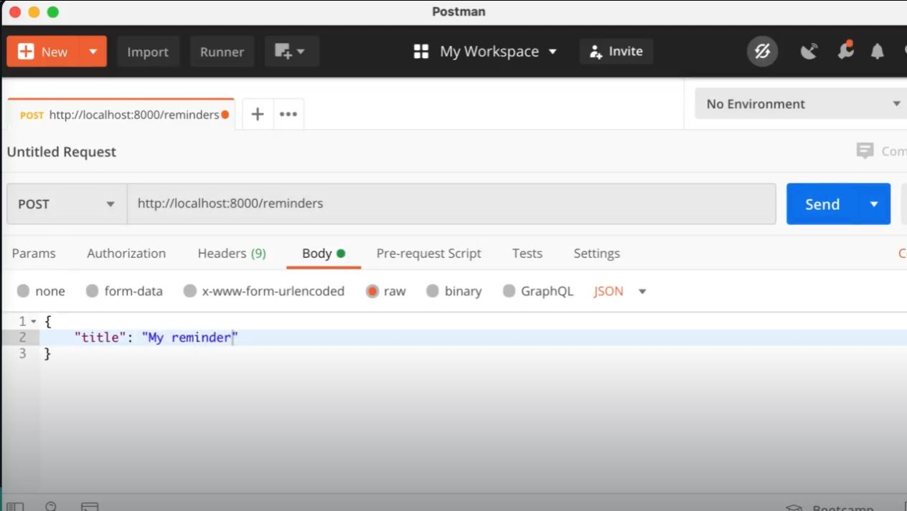
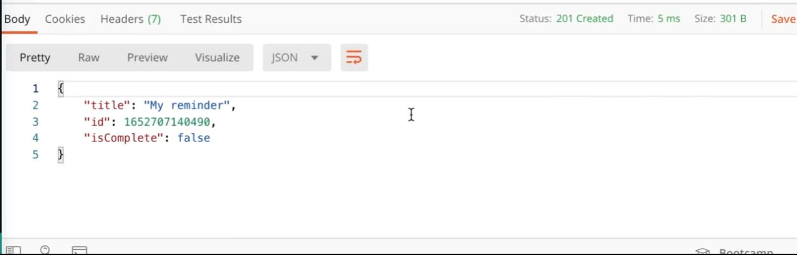

# 

# API Typescript+Express

- This is a simple API implementing Typescript with Express.
- Use Postman to test (https://www.postman.com/product/what-is-postman/).

- Technologies: Typescript, Node, Express.

## Demo

## Built with

Typescript, Node, Express

## How to build:

```
npm init -y
npm i -D ts-node
npm i express
npm i -D typescript @types/node @types/express
tsc --init
npm i -D nodemon

```

### Landing Page

> > 

### Query Filled Form

> > 

## Mobile support

### Development

Want to contribute? Great!

To fix a bug or enhance an existing module, follow these steps:

### Bug / Feature Request

## To-do

## Team

[](https://github.com/iharsh234)

[Luong Dang](https://github.com/luongkhdang)

MIT © [Luong Dang ](https://github.com/luongkhdang)
